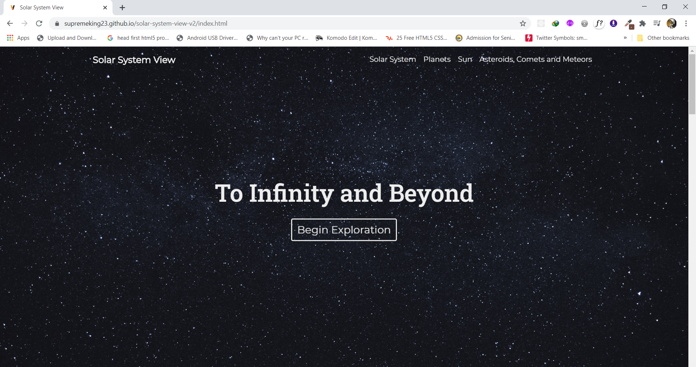
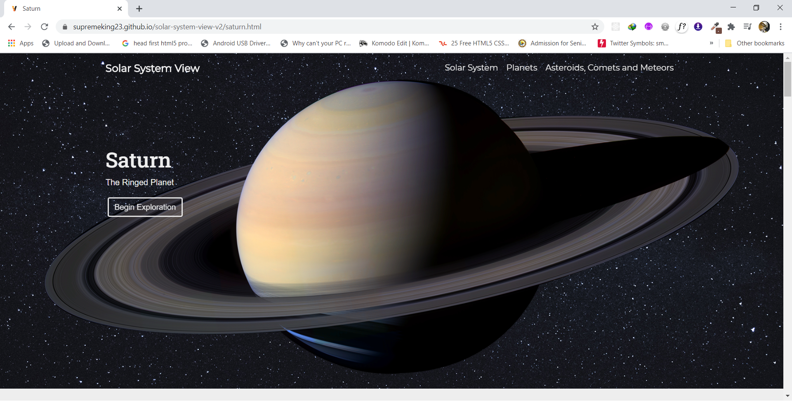

# Solar System View
[comment]: <> (a reference style link.)
Link: https://supremeking23.github.io/solar-system-view-v2/

**Solar System View** is a website that lets you explore the planets and other celestial body in the solar system. 

  - The 8 planets:
    - Mercury
    - Venus 
    - Earth 
    - Mars
    - Jupiter
    - Saturn
    - Neptune
    - Uranus
  - The Sun
  - Asteroids, Comets and Meteors
  - Magic

## Insperation
 The developers inspiration in creating __Solar System View__ website is to redesign __*Calvin J. Hamilton's*__ [Views of the Solar System](http://solarviews.com/eng/homepage.htm) 

## Tech 

Solar System View uses a number of technology to work properly:

* HTML5
* CSS3
* Javascript.
* Bootstrap 4.5
* JQUERY
* Slick Slider Carousel

## Developers
* Ivan Christian Jay E. Funcion
* Harold Nocos
* Micheal Pelagio

## Screenshots

